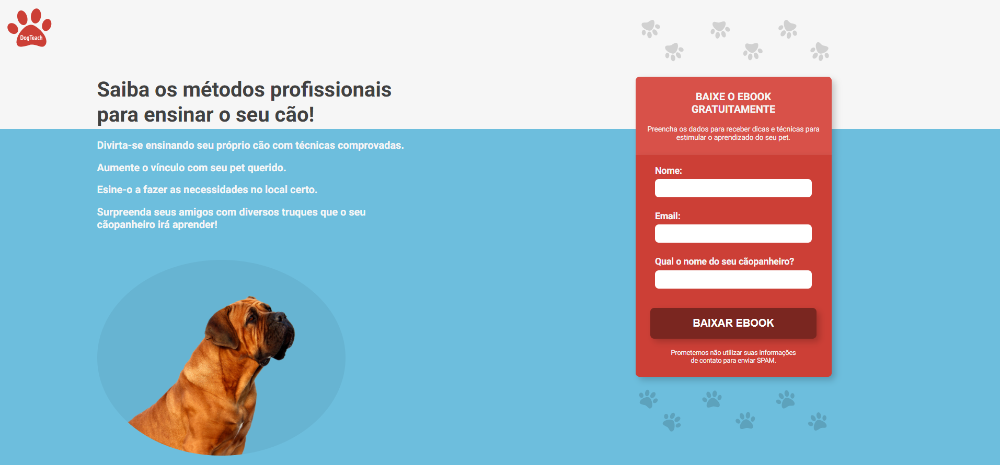

    

---

---

    

---

# Table of Contents
- [About](#-about)
- [Technologies](#-technologies)
<!-- - [Installation](#-installation) -->

---

## 📝 About
The **DogTeach** is a landing page developed for a company challenge. The propose of the page is to get leads and leave available an eBook with a lot of methods and tips to become a dog trainer.

---
## 🚀 Technologies
The project was developed with the following technologies: 

- HTML
- CSS
- JavaScript

---
Made with 💙 by ***João Brosin***.